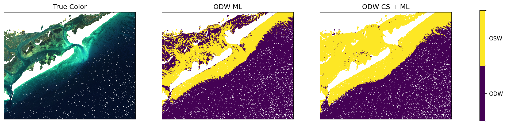

# Examples

This page provides practical examples for using the `physics_informed_ml_odw` package.

## Basic Usage

### Predicting ODW from a Satellite Image

```python
from sensingpy import reader
from physics_informed_ml_odw import predict_2d

# Load your satellite image
image = reader.open('path/to/satellite_image.tif')

# Predict ODW using the default ML model
odw = predict_2d(image, model='ML')
```

---

## Comparing Models

### Using Both ML and CS_ML Models

This example demonstrates how to compare predictions from both available models.

```python
from sensingpy import reader, plot
from physics_informed_ml_odw import predict_2d

# Load the satellite image
image = reader.open('data/formosa_2018.tif')

# Predict using both models
image['ODW_ML'] = predict_2d(image, 'ML')
image['ODW_CS_ML'] = predict_2d(image, 'CS_ML')
```

---

## Visualization

### Creating a Comparison Plot

Visualize the original image alongside ODW predictions using sensingpy's plotting utilities.

```python
from sensingpy import reader, plot
from physics_informed_ml_odw import predict_2d

# Load image and generate predictions
image = reader.open('data/formosa_2018.tif')
image['ODW_ML'] = predict_2d(image, 'ML')
image['ODW_CS_ML'] = predict_2d(image, 'CS_ML')

# Create a figure with 3 subplots
fig, axs = plot.get_geofigure(image.crs, 1, 3, figsize=(6 * 3, 6))

# Plot true color RGB composite
plot.plot_rgb(image, 'Rrs_B4', 'Rrs_B3', 'Rrs_B2', axs[0], brightness=30)

# Plot ODW predictions
plot.plot_band(image, 'ODW_ML', axs[1])
plot.plot_band(image, 'ODW_CS_ML', axs[2])

# Add titles
axs[0].set_title('True Color')
axs[1].set_title('ODW ML')
axs[2].set_title('ODW CS + ML')
```



---

## Working with Models Directly

### Loading and Inspecting a Model

```python
from physics_informed_ml_odw import load_model

# Load the ML model
pipeline = load_model('ML')

# Inspect the model's expected features
print("Expected features:", pipeline.feature_names_in_)

# Access pipeline steps
for name, step in pipeline.steps:
    print(f"Step: {name}, Type: {type(step).__name__}")
```

### Custom Predictions with Loaded Model

```python
import pandas as pd
import numpy as np
from physics_informed_ml_odw import load_model

# Load model
pipeline = load_model('CS_ML')

# Prepare your own data
data = pd.DataFrame({
    'Rrs_B1': [...],
    'Rrs_B2': [...],
    'Rrs_B3': [...],
    'Rrs_B4': [...],
    # Include all required bands
})

# Make predictions
predictions = pipeline.predict(data)
```

---

## Error Handling

### Handling Invalid Model Names

```python
from physics_informed_ml_odw import load_model

try:
    model = load_model('invalid_model')
except ValueError as e:
    print(f"Error: {e}")
    # Output: Error: Model must be one of ['ML', 'CS_ML'], got 'invalid_model'
```

---

## Integration with Workflows

### Batch Processing Multiple Images

```python
from pathlib import Path
from sensingpy import reader
from physics_informed_ml_odw import predict_2d
import numpy as np

# Directory containing satellite images
image_dir = Path('data/images/')

# Process all GeoTIFF files
for image_path in image_dir.glob('*.tif'):
    print(f"Processing: {image_path.name}")
    
    # Load and predict
    image = reader.open(str(image_path))
    odw = predict_2d(image, model='ML')
    
    # Save results
    output_path = image_path.with_suffix('.odw.npy')
    np.save(output_path, odw)
    
    print(f"Saved: {output_path.name}")
```
